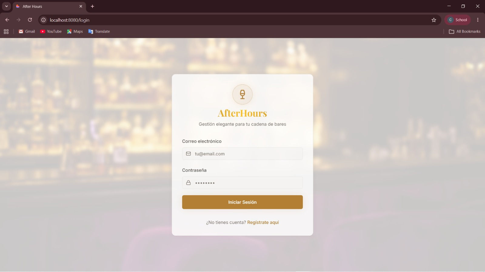
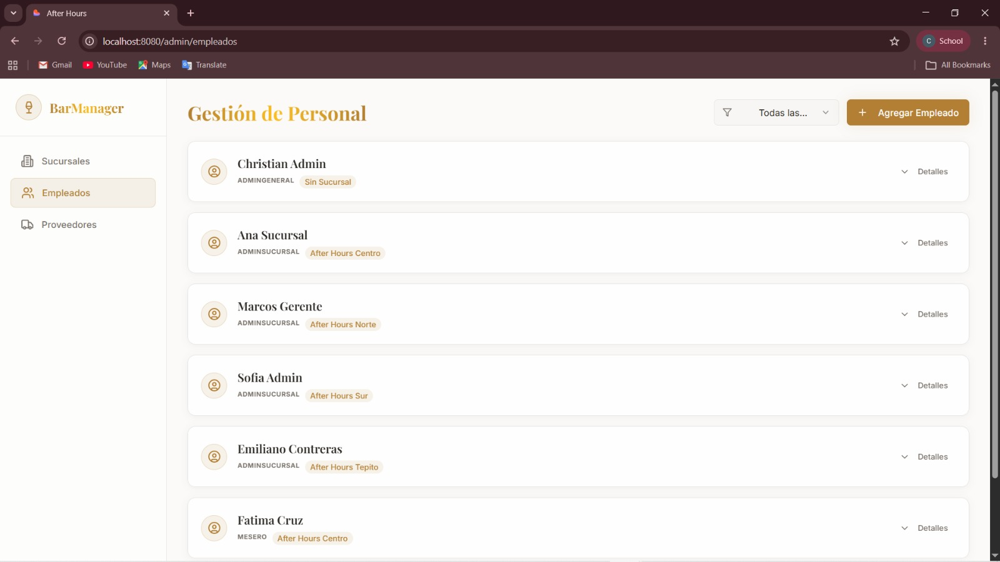
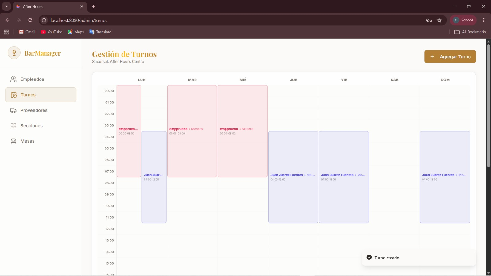
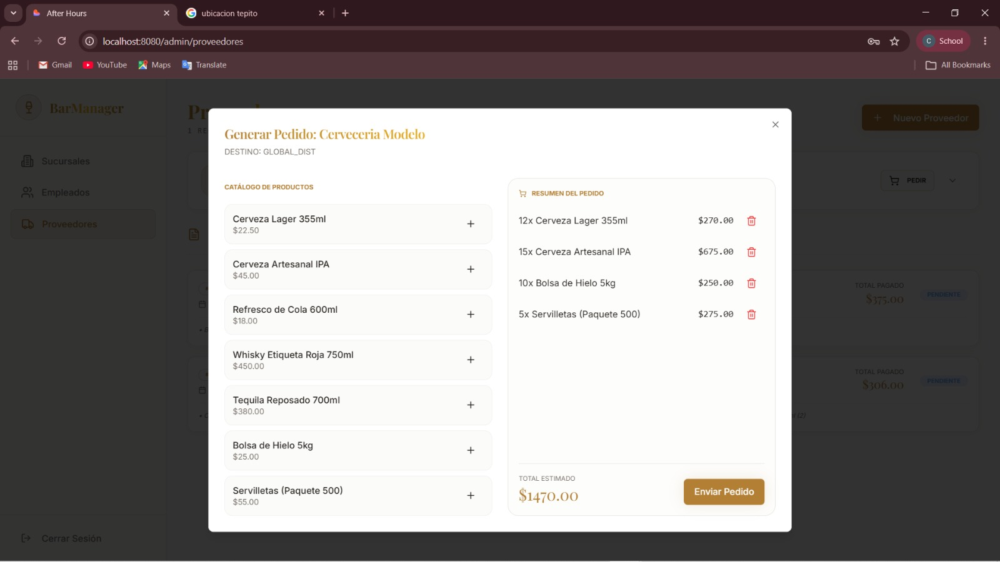

# After Hours - Sistema de Gestión para Cadena de Bares

## Descripción del Proyecto

After Hours es un sistema web desarrollado para la administración y operación de una cadena de bares. El sistema permite gestionar procesos administrativos y operativos como el control de usuarios, sucursales, empleados, turnos, inventario y órdenes de compra, centralizando la información de cada establecimiento dentro de una misma plataforma.

El objetivo principal del proyecto es optimizar la organización interna de los bares, facilitando el control del personal, la asignación de horarios y la administración de recursos mediante una interfaz web moderna y accesible.

Entre las principales funcionalidades del sistema se encuentran:

- Inicio de sesión y autenticación de usuarios.
- Registro y administración de empleados.
- Gestión de sucursales.
- Control y planificación de turnos laborales.
- Generación de órdenes de compra.

---

## Tecnologías Utilizadas

### Frontend
- React
- Next.js
- TypeScript
- Tailwind CSS
- Lucide React

### Backend
- Next.js API Routes
- Node.js
- TypeScript

### Base de Datos
- MongoDB

### Contenedores y Virtualización
- Docker
- Docker Compose

---

## Arquitectura de Contenedores

El proyecto utiliza Docker para facilitar la ejecución y despliegue del sistema.

### Contenedores principales

#### MongoDB
Contenedor encargado de almacenar y administrar la base de datos del sistema.

### Comunicación

La aplicación web se comunica con MongoDB mediante la red interna definida en Docker Compose.

---

## Ejecución del Proyecto

### Requisitos
- Docker
- Docker Compose
- Node.js
- npm

### Clonar el repositorio

```bash
git clone https://github.com/Christian54681/After-Hours.git
cd After-Hours
```

### Ejecutar con Docker

```bash
docker-compose up --build
```

### Ejecutar manualmente

#### Instalar dependencias

```bash
npm install
```

#### Ejecutar seed de la base de datos

```bash
node backend/scripts/seed.ts
```

#### Iniciar el proyecto

```bash
npm run dev
```

---

## Imágenes del Proyecto

### Inicio de Sesión



### Gestión de Empleados



### Gestión de Turnos



### Órdenes de Compra



---

## Integrantes

- Contreras Pérez Luis Emiliano
- Cruz Guerrero Fatima
- Díaz Carbajal Josué
- López Jiménez Christian Gregorio
- Narvaez Morales Jonathan
